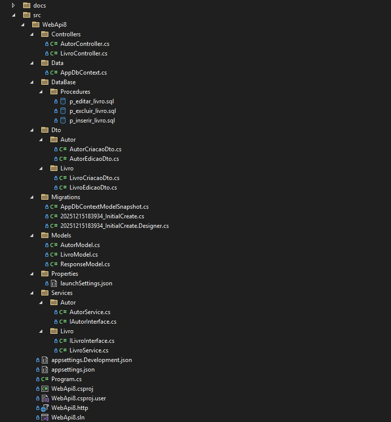
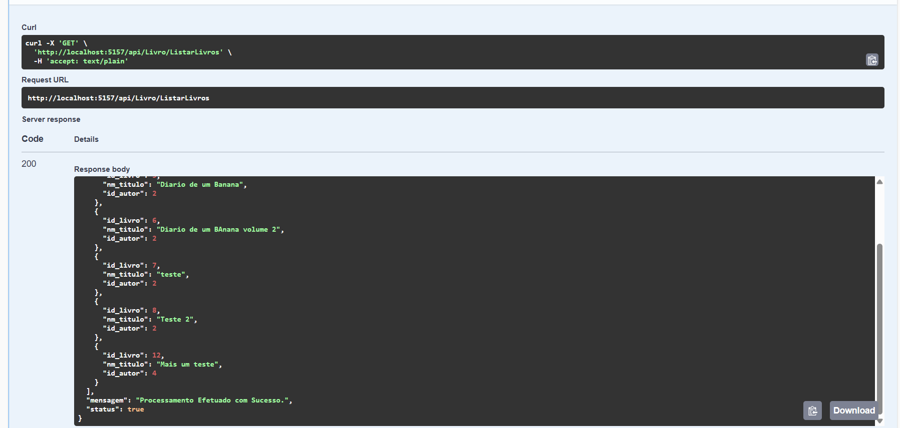
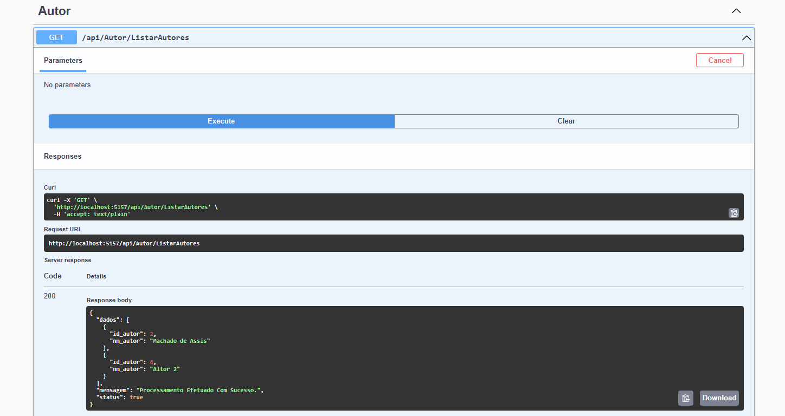

# 📚 Projeto .NET – Gestão de Livros

Este projeto foi desenvolvido com o objetivo de **estudar e consolidar conhecimentos em .NET**, explorando diferentes formas de acesso a dados no **SQL Server** e entendendo melhor a estrutura de uma aplicação backend moderna.

O desenvolvimento foi dividido em **duas etapas principais**, cada uma com um foco técnico diferente.

---

## 🧩 Objetivo do Projeto

* Compreender a estrutura básica de um projeto .NET
* Estudar a comunicação entre aplicação e banco de dados SQL Server
* Comparar abordagens de acesso a dados utilizando **Entity Framework** e **Dapper**
* Praticar boas práticas de organização, consultas SQL e uso de **Stored Procedures**

---

## 🛠️ Tecnologias Utilizadas

* .NET
* C#
* SQL Server
* Entity Framework Core
* Dapper
* Stored Procedures
* Git / GitHub

---

## 🧪 Estrutura do Projeto

O projeto foi desenvolvido em duas fases distintas:

---

### 🔹 Fase 1 – Módulo de autores (Entity Framework – EF Core)

A primeira parte do projeto foi acompanhada e teve como foco principal:

* Entender a estrutura de um projeto .NET
* Aprender como funciona a comunicação com o banco de dados via ORM
* Utilizar o **Entity Framework Core** para:

  * Mapeamento de entidades
  * Criação de contexto de banco de dados
  * Execução de operações CRUD

Compreender conceitos como:

* `DbContext`
* `DbSet`
* Migrations
* Relacionamento entre entidades

Essa etapa teve caráter mais didático, servindo como base para entender o funcionamento interno da aplicação e o papel do ORM no acesso aos dados.

---

### 🔹 Fase 2 – Módulo de Livros (Dapper + SQL Server)

A segunda parte do projeto, referente ao **módulo de livros**, foi desenvolvida de forma independente e com foco em uma abordagem mais próxima do banco de dados.

Nesta etapa foram utilizados:

* **Dapper** como micro ORM
* Queries SQL escritas manualmente
* Stored Procedures no SQL Server

**Principais características desta fase:**

* Maior controle sobre as consultas SQL
* Uso explícito de Stored Procedures para operações de inserção, atualização, exclusão e consulta
* Separação clara entre:

  * Camada de aplicação
  * Camada de acesso a dados
  * Lógica de banco de dados

Foco em:

* Performance
* Clareza das queries
* Retorno de mensagens e códigos de status via procedures

Essa etapa teve como objetivo aprofundar o entendimento de como a aplicação se comunica diretamente com o SQL Server, sem abstrações excessivas.

---

## 📖 Visão Geral do Produto

Este sistema é uma aplicação voltada para o **gerenciamento de livros e autores**, permitindo o cadastro, consulta, atualização e remoção de registros de forma organizada e confiável.

O produto foi pensado para funcionar como um **backend de apoio a sistemas de catálogo**, podendo ser integrado a interfaces web, desktop ou mobile.

---

## 👤 O que o usuário pode fazer

Através do sistema, o usuário consegue:

### ✍️ Gestão de Autores
- 👤 Cadastrar autores  
- 🔍 Consultar autores cadastrados  
- ✏️ Atualizar informações de um autor  
- 🗑️ Remover autores  
- 🔗 Associar livros a seus respectivos autores  

* 📘 Cadastrar novos livros
* 🔍 Consultar livros já registrados
* ✏️ Atualizar informações de um livro
* 🗑️ Remover livros do catálogo
* 📄 Visualizar dados organizados e consistentes

Todas as operações são realizadas com segurança e persistidas em banco de dados, garantindo a integridade das informações.

---

## 🧭 Experiência de Uso

O fluxo de uso do produto é simples e direto:

1. O usuário acessa o sistema
2. Escolhe a operação desejada (cadastro, consulta, edição ou exclusão)
3. Informa os dados necessários
4. O sistema processa a solicitação
5. O resultado é apresentado de forma clara

O foco é oferecer uma experiência objetiva, sem complexidade desnecessária para quem utiliza.

---

## 🖥️ Exemplos de Uso

O sistema pode ser utilizado em diferentes cenários, como:

* Catálogo interno de livros
* Sistemas educacionais
* Aplicações de controle e organização de acervos

---

## 🖼️ Exemplos Visuais

Abaixo estão alguns exemplos representativos do funcionamento do produto.

## 🧱 Estrutura do Projeto

### 📘 Listagem de Livros

### ➕ Cadastro de Livro

### 👤 Detalhes do Autor

---

## 📌 Considerações Finais

Este projeto foi essencial para:

* Comparar **Entity Framework vs Dapper**
* Entender quando um ORM completo faz sentido e quando um micro ORM é mais adequado
* Praticar SQL Server de forma mais próxima da realidade do mercado
* Reforçar conceitos de backend com .NET

O projeto serve tanto como **material de estudo** quanto como **base para projetos futuros**, podendo ser expandido com frontend, autenticação, validações e outras funcionalidades.

